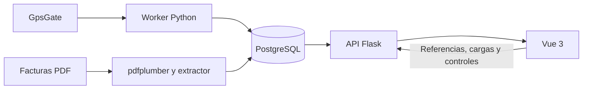

Análisis técnico de SAFCO — 8 de septiembre de 2026

El proyecto implementa una aplicación de control de combustible con dos estanques, telemetría de GpsGate, referencias de equipos y negocios, controles manuales, cargas y extracción de facturas PDF. La separación entre API, sincronizador e interfaz es aprovechable, pero hay errores reproducidos que afectan la exactitud de los saldos, los filtros históricos y los indicadores. La configuración incluida tampoco proporciona protección suficiente para exponer la API directamente.

La revisión cubrió el código de backend y frontend, modelos, rutas, cálculos, integración, dependencias, configuración Docker, documentación y el inventario de respaldos. Se identificaron 56 archivos de código/configuración Python, Vue, JavaScript y CSS, con aproximadamente 10.143 líneas. No se modificó la lógica de la aplicación.

Se realizaron comprobaciones locales con datos sintéticos. No se consultó la API real de GpsGate, no se accedió al servidor configurado y no se restauraron ni modificaron respaldos. Las comprobaciones de API utilizaron SQLite en memoria: prueban comportamiento de aplicación, pero no sustituyen pruebas de PostgreSQL, concurrencia ni una validación del despliegue real. No se realizó una inspección visual en navegador ni una auditoría de vulnerabilidades de dependencias por CVE.

La arquitectura observada es:

| Área | Implementación actual |
| --- | --- |
| Interfaz | Vue 3, Vue Router, Axios, Chart.js, Tailwind y Vue CLI/Webpack |
| Pantallas | Panel general, administración de registros, carga manual y gestión de facturas |
| API | Flask, CORS global, SQLAlchemy, seis blueprints |
| Persistencia | PostgreSQL 14 en Compose; seis modelos; creación automática de tablas |
| Sincronización | Proceso separado que consulta GpsGate y escribe `registros_litros` |
| Facturas | Extracción de texto PDF y reglas para COPEC, ESMAX y notas de crédito |
| Estado compartido | Singleton `useDataFilters` y objeto reactivo `kpiStore` |
| Despliegue | Cuatro servicios: backend, frontend, base de datos y sincronizador |

Las versiones resueltas por el lockfile del frontend son Vue 3.5.24, Vue Router 4.6.3, Axios 1.13.2, Chart.js 4.5.1, date-fns 4.1.0, Tailwind 3.4.18 y Vue CLI Service 5.0.9. El backend no fija versiones; una instalación nueva puede resolver un conjunto distinto del usado en el servidor.

| Modelo | Responsabilidad y restricciones relevantes |
| --- | --- |
| `RegistroLitro` | Fecha UTC sin zona, litros, iButton, dispositivo y dos referencias. Unicidad por fecha y dispositivo; las fechas se truncan al segundo. |
| `Dato1` / `Dato2` | Catálogos de nombres usados como código de equipo y acción/área de negocio. Sin unicidad de nombre. |
| `LitrosControl` | Fecha, dispositivo, lecturas inicial/final y diferencia calculada. |
| `CargaCombustible` | Fecha y hora separadas, dispositivo y litros cargados. |
| `Factura` | Folio globalmente único, producto, litros, fecha de texto, total entero y proveedor predeterminado COPEC. No guarda tipo de documento. |

No existe un modelo de dispositivo con capacidad, configuración o integridad referencial: los dispositivos 1 y 2 y sus equivalencias están repartidos entre backend y frontend. Las referencias de `RegistroLitro` sí declaran claves foráneas con `SET NULL`. La existencia real de esas restricciones en una base antigua debe verificarse mediante inspección de PostgreSQL.

| API | Operaciones |
| --- | --- |
| `/datos` | GET y POST; POST actualiza si encuentra la misma fecha y dispositivo |
| `/datos/<id>` | PATCH de litros, iButton y referencias |
| `/dispositivos` | GET del catálogo estático configurado en el servicio; no descarga tracks |
| `/dato1`, `/dato2` | GET, POST y PUT/DELETE por ID |
| `/litros_control` | GET, POST y PUT/DELETE por ID |
| `/cargas_combustible` | GET, POST y PUT/DELETE por ID |
| `/facturas/listar`, `/facturas/subir` | Listado y carga PDF |
| `/facturas/<id>`, `/facturas/eliminar-multiple` | Borrado individual y múltiple |

`GET /datos` consulta exclusivamente PostgreSQL. Sin parámetros entrega las últimas 24 horas; con fechas entrega días completos y limita el rango a 366 días, recortándolo silenciosamente. Los nombres de las referencias se consultan en grupos, evitando una consulta por fila. Los listados se materializan completos; la paginación visible ocurre en el navegador.

Los hallazgos principales, ordenados por prioridad, son los siguientes. “Reproducido” significa observado mediante ejecución local; “inspección” significa demostrado por el código, sin afirmar que se haya observado en producción.

1. **Crítico: API sin autenticación ni autorización.** `Backend/app.py:12` activa CORS global y las rutas de lectura, modificación y borrado no verifican usuarios ni permisos. Se reprodujo un POST anónimo a `/dato1` con respuesta 201 y aceptación de un origen externo mediante CORS. Una persona con acceso de red a la API puede modificar registros y borrar facturas. No se comprobó si el servidor real añade controles externos. El repositorio no los configura.

2. **Crítico: credenciales y servidor de desarrollo.** `Backend/services/Ejemplo.py:44` contiene un token predeterminado de GpsGate; `docker-compose.yml` incluye la contraseña de PostgreSQL. No se reproduce aquí ningún secreto. `Backend/app.py:59` ejecuta Flask con `debug=True`, escuchando en todas las interfaces, y Compose publica el puerto 8081. El frontend también se sirve con el servidor de desarrollo, `allowedHosts: 'all'` y una URL HTTP fija hacia una IP externa. Corresponde retirar y rotar las credenciales incluidas, configurar autenticación y servir la aplicación con una configuración de producción.

3. **Alta: filtros históricos sin datos históricos.** `frontend/src/Views/SafcoDashboard.vue:363`, `BarsChart.vue:125` y los tres gráficos de `DashboardUi/pies` llaman a `/datos` sin enviar fechas. Aunque el usuario selecciona semana, mes, seis meses o un intervalo manual, solo filtran las 24 horas recibidas. Los watchers de los gráficos redibujan sin descargar el rango seleccionado. El backend sí soporta las fechas; falta conectar correctamente ese contrato. La tabla envía parámetros, pero además sufre el siguiente problema.

4. **Alta: el singleton conserva una pantalla desmontada.** `frontend/src/utils/useDataFilters.js:12` devuelve siempre el primer estado creado, incluidos los datos, dispositivos y callback de recarga de su primer consumidor. Una segunda pantalla descarga datos a referencias diferentes de las que usa el filtro. Se reprodujo con Vue real: el segundo consumidor mostraba el registro del primero. Tras detener el ámbito reactivo inicial, cambiar las fechas no llamó a ninguno de los callbacks. Separar filtros globales de datos de cada vista, o crear un store global con ciclo de vida propio, resuelve la raíz del problema.

5. **Alta: saldo de estanques construido con períodos distintos.** `frontend/src/Views/SafcoDashboard.vue:225` suma todas las cargas manuales y facturas disponibles, pero resta descargas provenientes del GET predeterminado de 24 horas. El resultado puede sobrestimar considerablemente las existencias. Hace falta una fecha de saldo inicial y movimientos completos desde ese punto, preferiblemente calculados en backend. El porcentaje de llenado se basa además en el máximo saldo histórico calculado, no en una capacidad física configurada.

6. **Alta: fechas de facturas rompen el saldo.** En `SafcoDashboard.vue:240` las fechas `DD-MM-YYYY` se pasan directamente a `new Date()` para determinar la primera carga, aunque más adelante se convierten con `toISO`. En la reproducción, una factura de 1.000 litros y una descarga posterior de 100 devolvieron 1.000, porque la fecha inicial inválida descartó la descarga. Una factura con `fecha: null` provocó `Cannot read properties of null (reading 'split')`. El servicio permite guardar esa factura incompleta.

7. **Alta: proveedor perdido y modelo de documentos insuficiente.** `Backend/modules/facturas/service.py:38` no pasa `proveedor` al modelo. Una extracción simulada como ESMAX se guardó efectivamente como COPEC. El extractor reconoce el tipo de documento, pero `Factura` no lo almacena; el frontend intenta reconstruirlo por texto o signo del total. El folio es único globalmente, por lo que no distingue proveedor ni tipo de documento. Toda factura con litros se trata como entrada al estanque fijo, incluso si es una nota de crédito con litros positivos. El vínculo factura–recepción física debe definirse explícitamente para evitar duplicar una carga también ingresada manualmente.

8. **Alta: errores de GpsGate convertidos en éxito.** `Backend/services/Ejemplo.py:1042` devuelve `{}` ante excepciones cuando `fallback_empty=True`; `consultar_por_fechas` lo habilita para ambos dispositivos. Después, el sincronizador interpreta la ausencia de registros como éxito. Una caída simulada de ambos dispositivos terminó con `ok: True`, cero recibidos y cero insertados. Es necesario distinguir “sin movimientos”, “fallo parcial” y “fallo total”, guardar la última sincronización correcta y mostrar la antigüedad del dato.

9. **Alta: reglas de entrada insuficientes.** Se reprodujo un POST a `/cargas_combustible` con dispositivo 999 y litros -100 aceptado con 201. Una factura con únicamente folio y los otros campos nulos también se aceptó con 201. No hay validación uniforme de tipos, rangos, valores finitos, catálogo de dispositivos ni estructura JSON. Los errores de base de datos se manejan de forma desigual; algunas respuestas incluyen detalles internos y borrar una factura inexistente produce 500 en vez de 404.

10. **Alta: distintas interpretaciones de zona horaria.** `Backend/utils/timezone.py:3` fija UTC-3, mientras el servicio GpsGate usa `America/Santiago` cuando está disponible. Se comprobó con la base horaria instalada que enero y junio de 2026 tienen offsets distintos. Esto afecta rangos por día y fechas manuales. En frontend se mezclan fechas locales, fechas ISO tratadas como UTC y agrupaciones con `toISOString()`. Una descarga próxima a medianoche puede agregarse a otro día. Conviene normalizar instantes en UTC, fechas de negocio en un formato único y presentación/rangos en una zona explícita.

11. **Media-alta: KPI global con fuentes incorrectas.** `SafcoInputData.vue:177` envía controles manuales como `datos`, aunque `KpiCards` espera campos `litros` y `dispositivo_id`; los totales de sensores pasan a cero. `SafcoTables.vue:3` escucha `update-kpis`, pero `DataTables.vue` no emite ese evento. Los KPI pueden permanecer en cero o conservar valores de otra pantalla. La vista de facturas tampoco inicializa estos indicadores al entrar directamente. Debe existir un contrato único para períodos y fuentes de KPI.

12. **Media: datos ficticios y errores poco visibles.** `BarsChart.vue` genera valores aleatorios si falla la petición. Cuando los dispositivos reales están seleccionados, esos registros pueden quedar ocultos por su identificador ficticio; en otros estados podrían mostrarse. En ambos casos se pierde la distinción entre error y ausencia de datos. Varias operaciones solo registran errores en consola. Los formularios se limpian después de emitir la solicitud, antes de saber si se guardó, y la edición de referencias no revierte el valor visual si falla.

13. **Media: extracción PDF frágil.** Se lee todo el texto sin límite de páginas propio ni un máximo de subida configurado en Flask. No hay OCR: los PDF escaneados requieren otro tratamiento. La detección del total de ciertos documentos toma posiciones fijas, como el séptimo importe encontrado. Se reprodujo que `500,00 L` no extrae litros con la regla final COPEC, que `05-XYZ-2025` se transforma en enero y que `31-02-2026` no se rechaza. Solo se exige el folio antes de persistir. Se necesita validación de resultado y revisión previa antes de afectar existencias.

14. **Media: sincronización con límites no explicitados.** Ambos procesadores suman puntos positivos y cierran un ciclo cuando llega un valor no positivo; descartan ciclos inferiores a 3 litros. `[2,3,0]` produjo 5 litros y `[2,3]` no produjo registros: los ciclos abiertos quedan pendientes. La validez de sumar, en vez de calcular diferencias, depende de que la variable sea incremental y no un contador acumulado; esto requiere contrastar telemetría real. Un ciclo cuyo comienzo queda fuera del rango puede procesarse parcialmente. El truncamiento al segundo combina eventos coincidentes y la actualización solo por fecha/dispositivo no elimina registros previos si cambia la fecha final de un ciclo por datos tardíos. Son escenarios que requieren pruebas con ejemplos reales.

15. **Media: la reconciliación bloquea la actualización rápida.** El worker ejecuta secuencialmente la consulta reciente, la de 15 días cada hora y la de 30 días cada día; al iniciar también revisa 15 días. Por ello “cada 60 segundos” significa espera entre trabajos, no una garantía de frescura de 60 segundos. Cada consulta diaria puede esperar 30 segundos por intento y reintentarse. No hay checkpoint persistente, bloqueo para múltiples workers ni recuperación automática de datos anteriores a 30 días. Sí existe ejecución manual por rango y salida controlada por señales.

16. **Media: migraciones y respaldo operativo incompletos.** `db.create_all()` se ejecuta al importar la aplicación tanto en API como en worker, pero no migra columnas o restricciones existentes. No hay migraciones versionadas ni historial de modificaciones de negocio. Hay cuatro respaldos en `backups`, incluido un SQL de roles con cláusula de contraseña y una copia del volumen. Los dos dumps tienen el mismo tamaño pero distintos hashes. No se comprobó su restaurabilidad ni su contenido completo. Faltan procedimientos verificables de restauración, retención y almacenamiento fuera del proyecto.

17. **Media: rendimiento y recursos de interfaz.** El dashboard realiza cinco peticiones independientes a `/datos` —la vista y cuatro gráficos—, con copias y filtros redundantes. No hay paginación de servidor ni actualización periódica visible de la interfaz, aunque el worker siga escribiendo. Los gráficos destruyen instancias al redibujar, pero no al desmontarse; algunos timers tampoco se cancelan. Los alias iButton están duplicados en varios componentes y agrupan por valor crudo aunque dos claves tengan el mismo alias. El backend representa ausencia con `N/A`, mientras el gráfico usa otra clave para “Sin iButton”.

18. **Media: compilación sensible a la ruta local.** `npm run build` falló con `Conflict: Multiple assets emit different content to the same filename index.html`. Se inspeccionó la configuración generada: el patrón absoluto de exclusión de CopyPlugin no excluye `public/index.html` en esta ruta con paréntesis. Se reprodujo con `fast-glob`; `**/index.html` sí lo excluyó. Una segunda compilación, ajustando solo ese patrón en memoria, terminó correctamente. No se aplicó el arreglo al código. Este fallo está confirmado en la ruta actual; no demuestra que falle también dentro del contenedor `/app`.

19. **Media-baja: documentación y mantenimiento.** Los README describen integración ThingsBoard activa, fusión en GET y puertos que no coinciden con Compose. Actualmente el backend se publica en 8081, PostgreSQL no publica un puerto al host y el frontend usa una IP externa. La documentación promete limpieza de gráficos al desmontar que el código no realiza. No se encontraron pruebas automatizadas propias, configuración CI, migraciones, endpoint de salud de API ni configuración de registro de errores centralizado. La carpeta recibida no tiene `.git`, por lo que no se puede inspeccionar historia o cambios pendientes con Git.

20. **Baja: detalles de interfaz y configuración.** La configuración Tailwind reproduce gran parte del tema predeterminado en más de mil líneas. Los componentes tienen estilos responsive, pero falta comprobarlos visualmente. El HTML deja `lang` vacío; los modales no implementan control de foco o cierre con Escape; varios botones de icono carecen de etiquetas accesibles. El historial anuncia un límite de 100 eventos, pero su filtrado no aplica ese corte. Existe un archivo vacío llamado `'2026-06-01'` y un `package.json` raíz vacío.

También hay decisiones positivas que conviene conservar: blueprints separados, modelos identificables, servicio de facturas separado del extractor, sincronización fuera del GET de la interfaz, timeout y reintentos de GpsGate, transacción única del lote de sincronización, preservación de `dato1_id` y `dato2_id`, consultas agrupadas de nombres, validación básica de rangos y volumen persistente de PostgreSQL con healthcheck.

La verificación realizada dejó estos resultados:

| Comprobación | Resultado y alcance |
| --- | --- |
| Sintaxis Python | Los 22 archivos pasaron `ast.parse`; sin importación de la aplicación para este chequeo. |
| Dependencias frontend | `npm ci --ignore-scripts --no-audit --no-fund` completado tras habilitar acceso fuera del sandbox; 976 paquetes. |
| ESLint | `npm run lint -- --no-fix`: sin errores, sin correcciones automáticas. `no-undef` está desactivado en el proyecto, por lo que este resultado tiene menor alcance. |
| Compilación normal | Falló por emisión duplicada de `index.html` en la ruta actual. |
| Compilación diagnóstica | Pasó con exclusión ajustada únicamente en memoria; tres advertencias de rendimiento. Entrada de aproximadamente 633 KiB sin comprimir, vendor de 478 KiB y logo de 343 KiB. |
| Inicio API en SQLite | Creación de tablas y siete GET principales con respuesta 200. Python local 3.13.7; Docker declara 3.11. |
| Mutaciones sintéticas | Confirmados acceso anónimo, carga negativa, dispositivo inexistente y POST con actualización de registro existente. |
| Validación de rangos | Fechas mal formadas e intervalo invertido: 400. Un intervalo mayor a 366 días se recortó sin error. |
| Facturas | Con extractor sustituido por resultados sintéticos, se reprodujeron proveedor ESMAX perdido y aceptación de fecha/litros/total nulos. No equivale a validar PDFs reales. |
| GpsGate | Con descarga de tracks simulada como error, el servicio de sincronización devolvió `ok: True`. Ninguna llamada al proveedor real. |
| Reactividad Vue | Reproducidas referencias del primer consumidor y pérdida del watcher al desmontar su ámbito. |
| Cálculo de existencias | Ejecutado el bloque real de cálculo con entradas sintéticas: saldo incorrecto y excepción por fecha nula. |
| Docker/PostgreSQL | Motor Docker no accesible; despliegue real y restauración no verificados. |

El orden de corrección propuesto es:

1. Proteger acceso, retirar secretos del código y desactivar debug en despliegue; resolver también la configuración de URL y HTTPS según el entorno.
2. Corregir saldo de estanques y fechas; establecer una fuente de movimientos completa y evitar que una factura incompleta afecte existencias.
3. Separar el estado de filtros del ciclo de vida de las vistas y unificar la petición de datos y la actualización de KPI.
4. Propagar fallos de GpsGate y registrar frescura, resultado y fallos por dispositivo; probar límites y recomposición de ciclos con telemetría real.
5. Persistir proveedor y tipo de documento, revisar unicidad del folio y validar los campos extraídos antes de guardar.
6. Añadir migraciones, validación uniforme, pruebas de regresión de los casos reproducidos y comprobación de restauración en PostgreSQL aislado.
7. Corregir la compilación en rutas con paréntesis, servir un build estático, reducir consultas y bundles, limpiar recursos gráficos y actualizar documentación.

La prioridad funcional es conseguir que tabla, gráficos, KPI y saldo representen el mismo período y los mismos movimientos. La prioridad operativa es que el sistema distinga un dato realmente actualizado de una sincronización fallida. Ambas deben resolverse antes de considerar confiables las cifras para uso operativo sin conciliación adicional.
